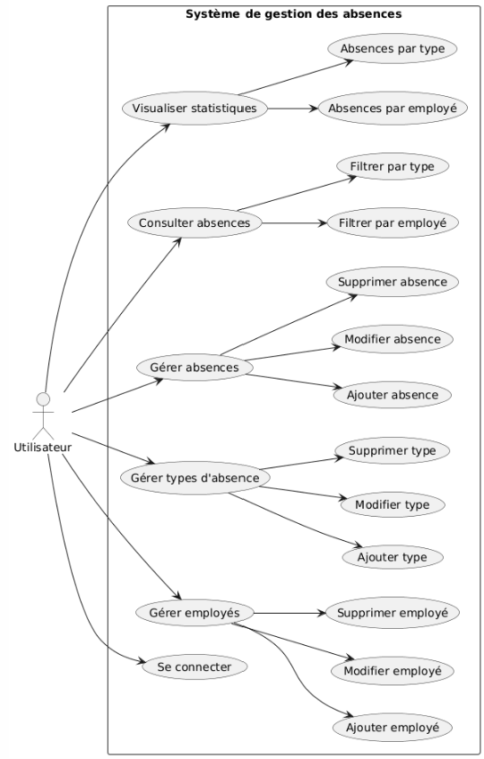
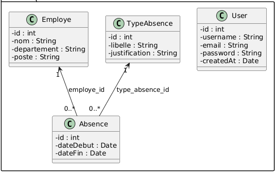

Gestion des Absences – GsAbsence

  

GsAbsence est une application de gestion des absences des employés.
Elle permet de gérer les employés, les types d’absences et le suivi des absences, avec des statistiques graphiques.
L’application est développée en Java (Swing) avec une base de données MySQL.

🎯 Objectif du Projet
L’objectif de ce projet est de faciliter la gestion des absences au sein d’une entreprise en automatisant :
L’enregistrement des absences,
Le suivi des employés,
La gestion des types d’absences,
La visualisation des statistiques.

✅ Fonctionnalités Principales  
  Authentification 
  Connexion utilisateur 
Inscription 
Gestion des Employés 
Ajout, modification et suppression 
Affectation par département et poste 
Gestion des Types d’Absence 
Maladie, congé, autorisation, etc. 
Justification obligatoire ou non 
Gestion des Absences 
Enregistrement des absences avec dates 
Association employé / type d’absence 
Filtrage par employé 
Statistiques 
Nombre d’absences par employé  
Nombre d’absences par type 
Visualisation graphique (JFreeChart) 

📄 Structure de la Base de Données

Table	Description 
employe	Informations des employés 
type_absence	Types d’absences 
absence	Absences enregistrées 
user	Utilisateurs de l’application 

🖥️ Technologies et Bibliothèques Utilisées

Java Swing : Interface graphique 
MySQL : Base de données relationnelle 
JDBC (MySQL Connector/J) : Connexion Java ↔ MySQL 
JCalendar : Gestion des dates 
JFreeChart : Statistiques graphiques 
Inno Setup : Génération de l’installateur Windows 

📊 Schéma SQL de la Base de Données

  
CREATE TABLE employe ( 
  id INT AUTO_INCREMENT PRIMARY KEY, 
  nom VARCHAR(100) NOT NULL, 
  departement VARCHAR(100) NOT NULL, 
  poste VARCHAR(100) NOT NULL 
); 
  
CREATE TABLE type_absence ( 
  id INT AUTO_INCREMENT PRIMARY KEY, 
  libelle VARCHAR(100) NOT NULL, 
  justification VARCHAR(50) 
); 
  
CREATE TABLE absence ( 
  id INT AUTO_INCREMENT PRIMARY KEY, 
  employe_id INT NOT NULL, 
  type_absence_id INT NOT NULL, 
  date_debut DATE NOT NULL, 
  date_fin DATE NOT NULL, 
  FOREIGN KEY (employe_id) REFERENCES employe(id), 
  FOREIGN KEY (type_absence_id) REFERENCES type_absence(id) 
); 
  
CREATE TABLE user ( 
  id INT AUTO_INCREMENT PRIMARY KEY, 
  username VARCHAR(50) UNIQUE NOT NULL, 
  email VARCHAR(100) UNIQUE NOT NULL, 
  passeword VARCHAR(255) NOT NULL, 
  created_at TIMESTAMP DEFAULT CURRENT_TIMESTAMP 
); 
 
🏢 Architecture du Projet

 GsAbsence/
 
          ├── gsabsence/
          │   ├── GsAbsence.java        # Point d’entrée
          │   ├── Home.java             # Fenêtre principale
          │   ├── Login.java            # Authentification
          │   ├── Registre.java         # Inscription
          │   └── ResetPassword.java
          │
          ├── gsabsence.UI/
          │   ├── AbsenceUI.java
          │   ├── EmployeUI.java
          │   ├── TypeAbsenceUI.java
          │   ├── ChartsAbsenceEmploye.java
          │   └── ChartsAbsenceParType.java
          │
          ├── gsabsence.entities/
          │   ├── Employe.java
          │   ├── Absence.java
          │   ├── TypeAbsence.java
          │   └── User.java
          │
          ├── gsabsence.service/
          │   ├── EmployeService.java
          │   ├── AbsenceService.java
          │   ├── typeAbsenceService.java
          │   └── userService.java
          │
          ├── gsabsence.dao/
          │   └── IDao.java
          │
          ├── gsabsence.connexion/
          │   └── Connexion.java
          │
          ├── gsabsence.util/
          │   └── UiUtils.java
          │
          ├── images/
          │   ├── logo.png
          │   ├── class_diagram.png
          │   └── use_case.png
          │
          └── README.md

🗂️ Diagrammes UML

📌 Diagramme de Cas d’Utilisation

  

📌 Diagramme de Classes

  

📽️ Démonstration Vidéo
<a href="https://drive.google.com/file/d/1PvvS6bx7giSMEzhsb9BKjFIdn9k3nCy1/view?usp=sharing">ici</a>
 

https://github.com/user-attachments/assets/1bf83cb3-e1f4-46fd-8c0a-2f9a1c13b9f6

🔒 Gestion des Utilisateurs
L’application gère des utilisateurs authentifiés permettant :
L’accès sécurisé à l’application
La gestion complète des données
La séparation entre interface et logique métier

⚙️ Architecture MVC
Modèle : entities, dao
Vue : gsabsence.UI (Swing)
Contrôleur / Services : service
Connexion DB : connexion

## 🤝 Contributeurs
BOUAICHI bADR

Encadrant: <a href="https://www.linkedin.com/in/mohamed-lachgar-33394b15/" target="_blank">**LACHGAR Mohamed**</a>
